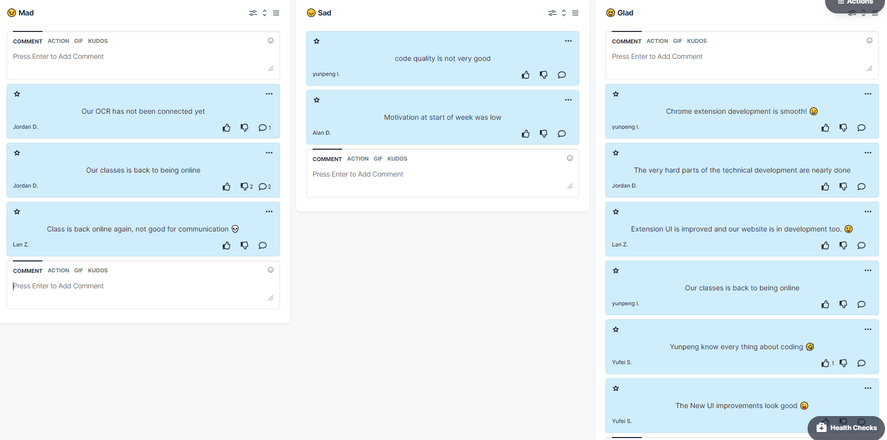
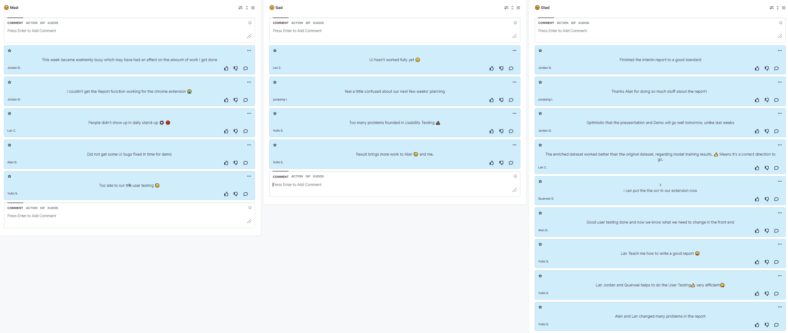
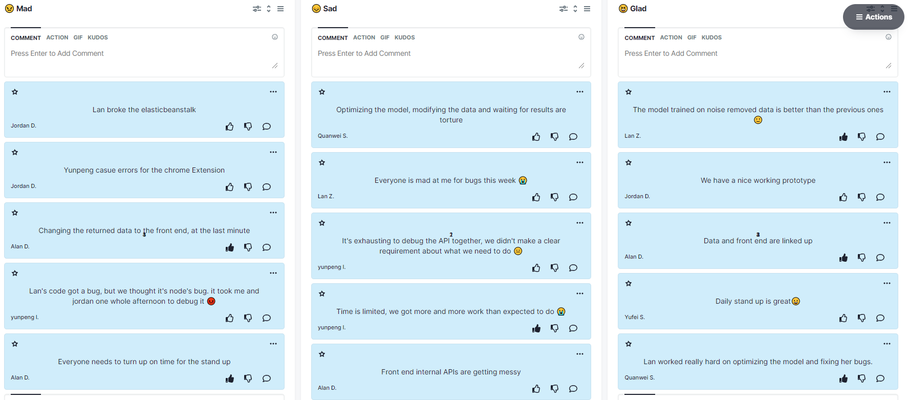
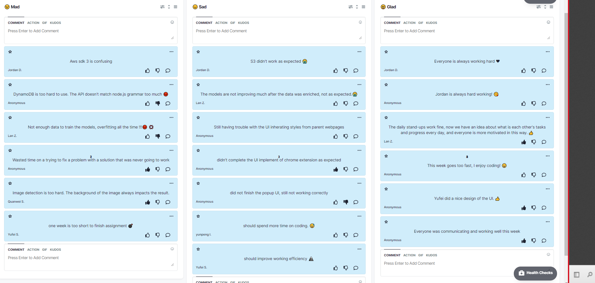

04/11/2021 - Retrospective

Participants: Yufei Su, yunpeng liu, Jordan Donnelly, Alan Dowley, Lan Zeng, Quanwei Sun

 Mad
- Our OCR has not been connected yet  ( Jordan Donnelly )
--- Have to finish the ML part first  ( Quanwei Sun )
- Our classes is back to being online  ( Jordan Donnelly, 2 Down Votes  )
--- should be happy  ( Quanwei Sun )
--- TRUE!  ( yunpeng liu )
- Class is back online again  not good for communication   ( Lan Zeng )

 Sad
- code quality is not very good  ( yunpeng liu )
- Motivation at start of week was low  ( Alan Dowley )

28/10/2021 - Retrospective
Participants: Yufei Su, yunpeng liu, Jordan Donnelly, Alan Dowley, Lan Zeng, Quanwei Sun

 Mad
- This week became exetremly busy which may have had an affect on the amount of work I got done  ( Jordan Donnelly )
- I couldn't get the Report function working for the chrome extension    ( Jordan Donnelly )
- People didn't show up in daily stand-up     ( Lan Zeng, 2 Up Votes  )
--- agree  ( Quanwei Sun )
- Did not get some UI bugs fixed in time for demo  ( Alan Dowley )
- Too late to run the user testing    ( Yufei Su )

 Sad
- UI hasn't worked fully yet    ( Lan Zeng )
- feel a little confused about our next few weeks' planning  ( yunpeng liu )
- Too many problems founded in Usability Testing   ( Yufei Su )
- Result brings more work to Alan  and me.  ( Yufei Su )

 Glad
- Finished the interim report to a good standard  ( Jordan Donnelly )
- Thanks Alan for doing so much stuff about the report！  ( yunpeng liu, 3 Up Votes  )
- Opitmistic that the presesntation and Demo will go well tomorrow  unlike last weeks  ( Jordan Donnelly )
- The enriched dataset worked better than the original dataset  regarding model training results.   Means it's a correct direction to go.  ( Lan Zeng )
- I can put the the ocr in our extension now  ( Quanwei Sun )
- Good user testing done and now we know what we need to change in the front end  ( Alan Dowley )
- Lan Teach me how to write a good report   ( Yufei Su )
- Lan Jordan and Quanwei helps to do the User Testing  very efficient  ( Yufei Su )
- Alan and Lan changed many problems in the report  ( Yufei Su )

21/20/2021 - Retrospective

Participants: Yufei Su, yunpeng liu, Jordan Donnelly, Alan Dowley, Lan Zeng, Quanwei Sun

 Mad
- Lan broke the elasticbeanstalk  ( Jordan Donnelly, 3 Up Votes  )
--- well done  ( Quanwei Sun )
- Yunpeng casue errors for the chrome Extension  ( Jordan Donnelly, 1 Up Vote  )
--- good job  ( Quanwei Sun )
- Changing the returned data to the front end  at the last minute  ( Alan Dowley, 1 Up Vote  )
- Lan's code got a bug  but we thought it's node's bug. it took me and jordan one whole afternoon to debug it   ( yunpeng liu, 1 Up Vote  )
- Everyone needs to turn up on time for the stand up  ( Alan Dowley, 4 Up Votes  )

 Sad
- Optimizing the model  modifying the data and waiting for results are torture  ( Quanwei Sun )
- Everyone is mad at me for bugs this week    ( Lan Zeng, 1 Up Vote  )
--- I didn't  ( Quanwei Sun )
- It's exhausting to debug the API together  we didn't make a clear requirement about what we need to do   ( yunpeng liu, 1 Up Vote  )
- Time is limited  we got more and more work than expected to do    ( yunpeng liu, 2 Up Votes  )
- Front end internal APIs are getting messy  ( Alan Dowley )

 Glad
- The model trained on noise removed data is better than the previous ones     ( Lan Zeng, 3 Up Votes  )
- We have a nice working prototype  ( Jordan Donnelly, 1 Up Vote  )
- Data and front end are linked up  ( Alan Dowley, 3 Up Votes  )
- Daily stand up is great  ( Yufei Su, 2 Up Votes  )
- Lan worked really hard on optimizing the model and fixing her bugs.  ( Quanwei Sun, 4 Up Votes  )

14/10/2021 - Retrospective

Participants: Yufei Su, yunpeng liu, Jordan Donnelly, Alan Dowley, Lan Zeng, Quanwei Sun

 Mad
- Aws sdk 3 is confusing  ( Jordan Donnelly )
- DynamoDB is too hard to use. The API doesn't match node.js grammar too much   ( Anonymous, 1 Up Vote , 1 Down Vote  )
- Not enough data to train the models  overfitting all the time !!!   ( Lan Zeng, 2 Down Votes  )
- Wasted time on a trying to fix a problem with a solution that was never going to work  ( Anonymous, 1 Up Vote  )
- Image detection is too hard. The background of the image always impacts the result.  ( Quanwei Sun, 1 Up Vote , 2 Down Votes  )
- one week is too short to finish assignment   ( Yufei Su )

 Sad
- S3 didn't work as expected   ( Jordan Donnelly )
- The models are not improving much after the data was enriched  not as expected.  ( Lan Zeng, 1 Down Vote  )
- Still having trouble with the UI inherating styles from parent webpages  ( Anonymous )
- didn't complete the UI implement of chrome extension as expected  ( Anonymous, 1 Up Vote  )
- did not finish the popup UI  still not working correctly  ( Anonymous, 2 Down Votes  )
- should spend more time on coding.    ( yunpeng liu )
- should improve working efficiency   ( Yufei Su, 1 Up Vote  )
- There's still a lot left to do   ( Yufei Su )

 Glad
- Everyone is always working hard   ( Jordan Donnelly )
- Jordan is always hard working!   ( Anonymous, 3 Up Votes  )
- The daily stand-ups work fine  now we have an idea about what is each other's tasks and progress every day  and everyone is more motivated in this way.    ( Lan Zeng, 3 Up Votes  )
- This week goes too fast  I enjoy coding!   ( Anonymous, 1 Up Vote  )
--- aha  me too  ( Lan Zeng )
- Yufei did a nice design of the UI.   ( Anonymous, 3 Up Votes  )
- Everyone was communicating and working well this week  ( Anonymous, 4 Up Votes  )
- Everyone is eager to help   ( Yufei Su )

